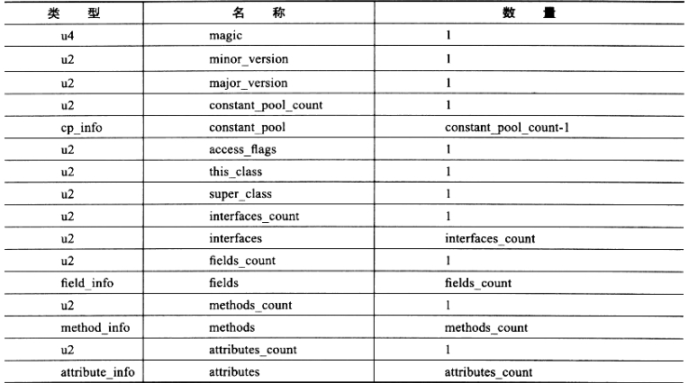
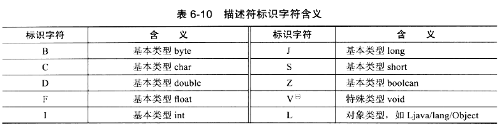
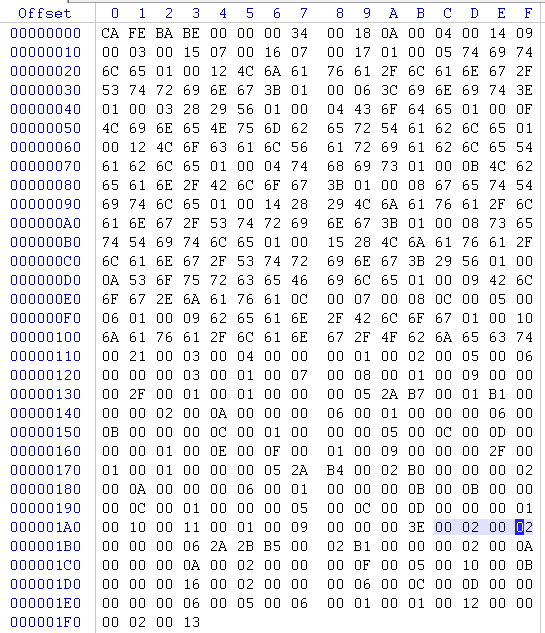

**语言无关**

除了Java语言， 其他语言也可以运行在Java虚拟机上。Java规范分为Java语言规范和Java虚拟机规范。 Java虚拟机不和包括Java在内的任何语言绑定， 它只与“Class文件”这种特定的二进制文件格式所关联。基于安全方面的考虑， Java虚拟机规范要求在Class文件中使用许多强制性的语法及结构化约束，但任何一门功能性语言， 只要可以把程序代码编译成能被Java虚拟机接受的有效的Class文件， 它就可以运行在Java虚拟机上。

## Class类文件结构
Class文件中只有两种数据类型：无符号数和表

无符号数属于基本的数据类型， 以u1, u2, u4, u8分别表示1个字节， 2个字节， 4个字节和8个字节， 无符号数可以用来描述数字， 索引引用， 数量值或者按照UTF-8编码构成的字符串值。

表是由多个无符号数或者其他表作为数据项构成的复合数据类型， 所有表都习惯地以"_info"结构。表用于描述有层次关系的复合结构的数据， 整个Class文件本质上就是一张表：

无论是无符号数还是表，当需要描述同一类型但数量不一定的多个数据时，经常会使用一个前置的容量计数器加若干个连续的数据项的形式。


### 魔数/版本号 magic/version
每个Class文件中头4个字节称为魔数（magic）， 用于确定这个文件是否为一个能被虚拟机接受的Class文件。

第5,6个字节是Class文件次版本号（minor_version）， 第7,8个字节是主版本号（major_version）。高版本的JKD向下兼容以前版本的Class文件， 但不能运行以后版本的Class文件，即使文件格式并末发生变化。

### 常量池 constant_pool
constant_pool_count为常量池容量计数值，注意这个计数从1开始。假若该值为0x0016，即十进制的22，则表示常量池中有21项常量，索引值范围为1~21。Class文件结构中只有常量池容量计数是从1开始，其他集合类型，包括接口索引集合，字段表集合，方法表集合等容量计数是从0开始。

常量池（constant_pool）主要存放两大类常量：字面量和符号引用。

字面量比较接近Java语言层面的常量概念，如文本字符串， 声明为final的常量值等。

符号引用包括下面三类常量：

类和接口的全限定名

字段的名称和描述符

方法的名称和描述符

在Class文件中不会保存各个方法，字段的最终内存布局信息，因此这些字段，方法的符号引用不经过运行期转换无法得到真正的内存入口地址，也就是无法被虚拟机使用。当虚拟机运行时，需要从常量池中获得对应的符号引用，再在类创建时或运行时解析，翻译到具体的内存地址。

常量池中每一项常量都是一个表。在JDK1.7中有14种表， 表示14种常量类型。它们有一个共同的特点，表开始的第一位是一个u1类型的标志位tag， 代表当前常量属于哪种常量类型。

最常见的字符串类型CONSTANT_Utf8_info，结构如下：

类型 | 名称 | 数量
---|---|---
u1 | tag | 1
u2 | length | 1
u1 | bytes | length
length说明这个UTF-8编码的字符串长度是多少字节，它后面紧跟长度为length字节的连续数据是一个使用UTF-8缩略编码表示的字符串。  
在Class文件中方法， 字段，类或接口都需要使用CONSTANT_Utf8_info型常量描述名称，所以它们的最大长度就是length的最大值， 就是u2所表表达的最大值65535。Java中的字符串字面量(string literals)，如“abc"、"123"之类写在代码中的字符串literals也是如此。

### 访问标志 access_flags
access_flags为访问标志，标识一些类或接口层次的访问信息，如是否为public类型，是否为final类型。


标志名称 | 标志值 | 含义
---|---|---
acc_public | 0x0001 | 是否为public类型
acc_final | 0x0010 | 是否为final类型
acc_super | 0x0020 | 是否允许使用invokespecial字节码指令的新语意，jdk1.0.2之后编译的类该标志必须为真
...| | 

### 类索引/父索引/接口索引集合 	this_class/super_class/interface
类索引（this_class），父类索引（super_class），接口索引集合（interface）确定这个类的继承关系。  
类索引，父类索引都是u2类型的数据，分别指向一个类型为CONSTANT_Class_info的类描述符常量，从而可以找到CONSTANT_Utf8_info类型的全限定名字符串。全限定名，就是把类全名中的"."替换成"/"， 如"java/lang/Object"  
除java.lang.Object外，所有的Java类父类索引都不为0。  
接口索引集合是一组u2类型的数据集合，描述这个类实现了哪些接口，那些被实现的接口将按implements语句顺序排列在接口索引集中。

### 字段表集合 fields
字符集（field_info）用于描述接口或者类中声明的变量。字段（field）包括类级变量及实例级变量，但不包括方法内部声明的局部变量。
字符表结构：

类型 | 名称 | 数量
---|---|---
u2 | access_flags |	1
u2 | name_index | 1
u2 | descriptor_index |	1
u2 | attributes_count | 1
attribute_info | attributes attributes_count

access_flags表示字段是否为public，static，final，volatile，transient等信息。

name_index和descript_index都是对常量池的引用，分别代表字段的简单名称和描述符。  
简单名称是指没有类型和参数修饰的字符名称， 如`private String title;`字段简单名称为"title"  
描述符描述字段的数据类型，基本数据类型和代表无返回值的void类型都用一个大写字符表示，而对象类型则用字符L加对象的全限定名表示。

对于数组类型，每一维度将使用一个前置的"["字符来描述。如"java.lang.String[][]"表示为"[[Ljava/lang/String"，"int[]"被记录为"[I"  

attribute_info 表示一个属性表集合，包含若干属性表，用于存储一些额外的信息。

**字段表不会列出从超类或父接口中继承来的字段， 但可能列出原Java代码中不存在的字段， 如在内部类中为了保持对外部类的访问性，会自动添加指向外部类实例的字段。**

### 方法表集合
方法表与字段表类似， 结构如下：

类型 | 名称 | 数量 
---|---|---
u2 | access_flags | 1
u2 | name_index | 1
u2 | descript_index | 1
u2 | attributes_count |	1
attribute_info | attributes | attributes_count	

name_index和descript_index也表示方法的简单名称和描述符。
简单名称指没有类型和参数修饰的方法名，如`public void setTitle(String title)`方法简称为"setTitle"  
描述符按先参数列表后返回值的顺序描述方法。参数列表按照参数的严格顺序放在一组小括号"()"之内。如方法`void inc()`描述符为"()V"，方法`int indexOf(char[] source, int sourceOffset, int sourceCount, char[] target, int targetoffset, int targetCount, int fromIndex)`的描述符为"([CII[CIII)I"。

**如果没有重写父类的方法，那方法表中就不会出现来自父类的方法信息， 但可能会出现由编译器自动添加的方法，如类构造器"<clinit>"和实例构造器"<init>"方法。**

方法属性表存储一些额外的修改。如方法里的Java代码，经过编译器编译成字节码指令后，存放在方法属性表中一个名为"Code"的属性里面。

### 属性表集合
在Class文件， 字段表， 方法表都可以携带自己的属性表集合，以用于描述某些场景专有的信息。  
上述已经说过每个字段和方法最后都可以携带一个属性表集合，用于存储一些额外的信息。而类最后也会携带一个属性表集合，存储一些class文件的信息。

属性表结构

类型 | 名称 | 数量
---|---|---
u2 | attribute_name_index | 1
u4 | attributes_length | 1
u1 | info | attributes_length
attribute_name_index引用一个CONSTANT_Utf8_info常量表示属性名称  
attributes_length表示属性的值占字节长度。它后面紧跟长度为attributes_length字节的连续数据是属性具体的值。

一些常用的属性：

属性名称 | 使用位置 | 含义
---|---|---
Code | 方法表 | Java代码编译成的字节码指令
Exceptions | 方法 | 方法抛出的异常
InnerClasses | 类文件 | 内部类列表
Deprecated | 类，方法表，字段表 | 被声明为deprecated的类，方法或字段
Signature | 类，方法表，字段表 | 记录泛型中的相关信息
... | | 


### 解析class文件
下面解析一个class文件  
java源码：
```
package bean;

public class Blog
{
  private String title;

  public String getTitle()
  {
    return this.title;
  }

  public void setTitle(String title) {
    this.title = title;
  }
}
```

使用WinHex打开class文件


根据上述的class类定义，解析这个class文件

16进制值 | 10进制值 | 解析
---|---|---
ca fe ba be | |  魔法数
00 00 | | 次版本  
00 34 | 52 | 主版本(使用jdk8编译)
00 18 | 24 | 常量数个数，该class文件中有23个常量，索引下标1~23
**常量池开始** | -- | --
0a | 10 |  **常量#1**  
00 04 | 4 | 指向常量#4
00 14 | 20 |指向常量#20
09 | 9 | **常量#2**  
00 03 | 3 | 指向常量#3
00 15 | 21 | 指定索引#21
07 | 7 | **常量#3** 
00 16 | 22 | 指向索引#22
07 | 7 | **常量#4**
00 17 | 23 | 指向#23
01 | 1 | **常量#5** 字符串常量
05 | 5 | 长度5
7469746c65 | | 字符串值:title
01 | 1 |  **常量#6** 字符串常量
00 12 | 18 |  长度18
4c6a6176612f6c616e672f537472696e673b | | 字符串值:Ljava/lang/String;
01 | 1 | **常量#7** 字符串常量
00 06 | 6 | 长度6
3c 69 6e 69 74 3e | | 字符串值: <init&#62;
01 | 1 | **常量#8** 字符串常量
00 03 | 3 | 长度3
28 29 56  | | 字符值:()V 
01 | 1 |  **常量#9** 字符串常量
00 04 | 4 | 长度4 
43 6f 64 65 | | 字符串值:code
01 | 1 |  **常量#10** 字符串常量
00 0f | 15 | 长度15
4C696E654E756D6265725461626C65 | | 字符串值: LineNumberTable
01 | 1 |  **常量#11** 字符串常量
00 12 | 18 | 长度18
4C6F63616C5661726961626C655461626C65 | | 字符串值:LocalVariableTable
01 | 1 |  **常量#12** 字符串常量
00 04 | 4 | 长度4
74686973 | | 字符串值:this
01 | 1 |  **常量#13** 字符串常量
00 0b len | 11 | 长度11
4C6265616E2F426C6F673B | | 字符串值:Lbean/Blog;
01 | 1 |  **常量#14** 字符串常量
00 08 | 8 | 长度8
6765745469746C65 | |  字符串值:getTitle
01 | 1 |  **常量#15** 字符串常量
00 14 | 20 | 长度20
28294C6A6176612F6C616E672F537472696E673B | | 字符串值:()Ljava/lang/String;
01 | 1 |  **常量#16** 字符串常量
00 08 | 8 | 长度8
7365745469746C65 | | 字符串值:setTitle
01  | 1 |  **常量#17** 字符串常量
00 15  | 21 | 长度21
284C6A6176612F6C616E672F537472696E673B2956 | | 字符串值:(Ljava/lang/String;)V
01  | 1 |  **常量#18** 字符串常量
00 0a |  10 | 长度10
536F7572636546696C65 | | 字符串值:SourceFile
01 | 1 |  **常量#19** 字符串常量
00 09 | 9 | 长度9
426C6F672E6A6176610C | | 字符串值:Blog.java
0c | 12 |  **常量#20** name_andtype_info
00 07 | 7 | 指向常量#7 
00 08 | 8 | 指向常量#8
0c | 12 | **常量#21** 
00 05 | 5 | 指向常量#5
00 06 | 6 | 指向常理#6
01 | 1 | **常量#22** 字符串常量
00 09 | 9 | 长度9
6265616E2F426C6F67 | | 字符串值:bean/Blog
01 | 1 |  **常量#23** 字符串常量
00 10 | 16  | 长度16
6A6176612F6C616E672F4F626A656374 | | 字符串值:java/lang/Object
**常量池结束** | -- | --
00 21 | | access_flags : 0x0021表示public类而且允许使用invokespecial字节码
00 03 | 3 | 类索引，指向常量#3
00 04 | 4 | 父类索引，指向常量#4
00 00 | | 接口索引，该class没有实现接口
**字段表开始** | -- | --
00 01 | 1  | 1个字段  (位置110/8)
00 02 | 2 |   private字段
00 05 | 5 | 指向常量#5 -字符串值:title
00 06 | 6 | 指向常量#6 -字符串值:Ljava/lang/String;
00 00 | 0 | 该字段没有携带属性
**字段表结束** | -- | --
**方法表集合开始** | -- | -- 
00 03 | 3 | 3个方法(位置:120/1)
00 01 | 1 | **方法1** public方法
00 07 | 7 | 指向常量#7 -字符串值:inti<>
00 08 | 8 | 指向常量#8 -字符串值:()V
00 01 | 1 | 该方法携带1个属性 
00 09 | 9 | 属性名称 指向常量#9 -字符串值:code 
00 00 00 2f | 47 | 属性的值占47个字符
0001...(47个字节) | | 属性的值
00 01 | 1 | **方法2**  public方法 (位置160/1)
00 0e | 14 | 指向常量#14 -字符串值:getTitle
00 0f | 15 | 指向常量#15 -字符串值:()Ljava/lang/String
00 01 | 1 | 该方法携带1个属性
00 09 | 9 | 属性名称 指向常量#9 -字符串值:code 
00 00 00 2f | 47 | 属性的值占47个字符
0001...(47个字节) | | 属性的值
00 01 | 1 | **方法3**  public方法 (位置:190/e)
00 10 | 16 | 指向常量#16 -字符串值:setTitle
00 11 | 17 | 指向常量#17 -字符串值:(Ljava/lang/String;)V
00 01 | 1 | 该方法携带1个属性
00 09 | 9 | 属性名称 指向常量#9 -字符串值:code 
00 00 00 3e | 62 | 属性的值占46个字符
0002..(62个字节) |  | 属性的值
**方法表集合结束** | -- | --
00 01 | 1 | 该class携带一个属性 (位置:1e0/a)
00 12 | 18 | 属性名称 指向常量#18 -字符串值:SourceFile
00 00 00 02 | 3 | 属性的值占2个字符
00 13 | |  max_stack  max_locals

*表中（位置:x/y）对应上图中字节在WinHex中的位置*


