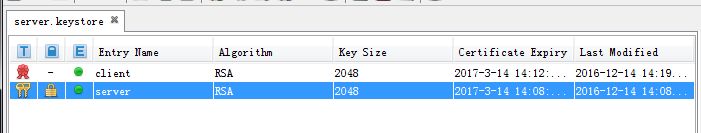

本文简单记录keystore里的定义及java中如何加载keystore。
<!--more-->

密钥库是存储加密密钥和证书的存储设备。 它们最常用于SSL通信，用来证明服务器和客户端的身份。 三种条目可以存储在密钥库中。

PrivateKey：用于非对称加密的密钥条目。因为它很敏感，所以常用密码保护，它也常用于加密数字签名
Certificate ：证书，证书中常包含公钥。它通常用于验证服务器的身份。 
SecretKey：用于对称加密的密钥条目。

Java中有几种不同类型的密钥库：JKS，JCEKS，PKCS12，PKCS11和DKS。 您可以在Oracle的Java Cryptography Architecture描述中找到这些密钥库的介绍。


KeyStore 是java定义的密钥库，可以存储PrivateKey和Certificate，但不能存储SecretKey。KeyStore可以使用KeyStore Explorer 查看。

可以使用keytool工具生成了server.keystore:
```
>keytool -genkey -alias server  -keyalg RSA  -keystore server.keystore
输入密钥库口令:
再次输入新口令:
您的名字与姓氏是什么?
  [Unknown] :   a
您的组织单位名称是什么?
  [Unknown] :  a
您的组织名称是什么?
  [Unknown] :  a
您所在的城市或区域名称是什么?
  [Unknown] :  a
您所在的省/市/自治区名称是什么?
  [Unknown] :  a
该单位的双字母国家/地区代码是什么?
  [Unknown] :  a
CN=a, OU=a, O=a, L=a, ST=a, C=a是否正确?
  [否]:  y

输入 <server> 的密钥口令
        (如果和密钥库口令相同, 按回车):
再次输入新口令:
```
命令执行完后，当前目录会生成server.keystore， server.keystore中包含了PrivateKey和Certificate。  
**上面输入了密钥库口令和密钥口令，密钥库口令用于打开密钥库，而密钥口令用于在java中加载PrivateKey**
alias用于区分密钥库的不同条目。

如果客户需要我们的证书，那我们可以从server.keystore导出cer类型的证书：
```
>keytool -export -file server.cer -alias server -keystore server.keystore
输入密钥库口令:
存储在文件 <server.cer> 中的证书
```
执行上述命令，可以看到当前目录已经导出了server.cer


如果我们获取得了客户的证书，并信任客户证书，就可以将客户证书导入到server.keystore中。
```
>keytool -import -keystore server.keystore -file client.cer -alias  client
输入密钥库口令:
所有者: CN=b, OU=b, O=b, L=b, ST=b, C=b
发布者: CN=b, OU=b, O=b, L=b, ST=b, C=b
序列号: 49b9bb52
有效期开始日期: Wed Dec 14 14:12:26 GMT+08:00 2016, 截止日期: Tue Mar 14 14:12:2
6 GMT+08:00 2017
证书指纹:
         MD5: 00:A4:8E:2B:EA:2A:61:18:0A:D1:0F:2F:AB:99:E8:25
         SHA1: 1B:F4:46:73:21:27:95:CE:2A:07:B8:16:52:A5:78:09:B3:84:EC:D4
         SHA256: E7:1B:D0:D4:35:9A:7C:58:11:F5:25:C6:D7:F3:E7:96:93:C4:45:AF:49:
12:9E:A5:B7:3E:F1:84:9D:CA:D1:EB
         签名算法名称: SHA256withRSA
         版本: 3

扩展:

#1: ObjectId: 2.5.29.14 Criticality=false
SubjectKeyIdentifier [
KeyIdentifier [
0000: 87 9C 8D 23 16 AA 95 87   D9 12 F1 89 B7 71 E1 84  ...#.........q..
0010: 93 5B 37 CE                                        .[7.
]
]
```
使用KeyStore Explorer 打开server.keystore
  
可以看到当前密钥库中存在两个条目，一个是client的证书，另一个是server的密钥对，可以使用密钥对导出证书。


java中定义了java.security.KeyStore，javax.net.ssl.KeyManagerFactory，javax.net.ssl.TrustManagerFactory这几个类来处理KeyStore，PrivateKey，Certificate。

在java程序中`trustManagerFactory.init(null);`加载证时，java会按如下顺序查找keystore  
1. 如果定义了system property:javax.net.ssl.trustStore,则加载该属性指定文件。  
如果还定义了javax.net.ssl.trustStore属性，则其值将用于打开信任库之前检查其中的数据的完整性。  
2. 如果<java-home>/lib/security/jssecacerts存在，则使用该文件。  
3. 如果<java-home>/lib/security/cacerts 存在，则使用该文件。  

也可以通过如下代码自行加载keystore：
```
public static SSLContext loadSSLContext(String jksPath, String publicPassword, String privatePassword)
            throws Exception {
        // 加载KeyStore
        InputStream in = new FileInputStream(jksPath);
        KeyStore ks = KeyStore.getInstance(KeyStore.getDefaultType());
        ks.load(in, publicPassword.toCharArray());	// 密钥库口令
        in.close();

        // 加载密钥
        KeyManagerFactory kmf = KeyManagerFactory.getInstance(KeyManagerFactory.getDefaultAlgorithm());
        kmf.init(ks, privatePassword.toCharArray());	// 密钥口令

        // 加载信任证书
        TrustManagerFactory trustManagerFactory = TrustManagerFactory
                .getInstance(TrustManagerFactory.getDefaultAlgorithm());
        trustManagerFactory.init(ks);


        // 加载SSLContext
        SSLContext sslContext = null;
        sslContext = SSLContext.getInstance("TLSv1");   //TLSv1为目前常用协议
        sslContext.init(kmf.getKeyManagers(), trustManagerFactory.getTrustManagers(), new java.security.SecureRandom());
        return sslContext;
    }
```

参考：  
[Java 和 HTTP 的那些事（四） HTTPS 和 证书](http://www.aneasystone.com/archives/2016/04/java-and-https.html)  
[Different types of keystore in Java](http://www.pixelstech.net/article/1408345768-Different-types-of-keystore-in-Java----Overview)
