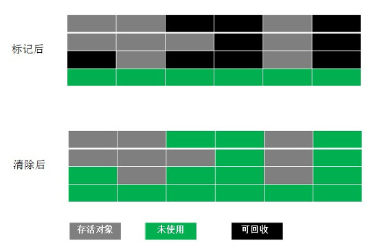
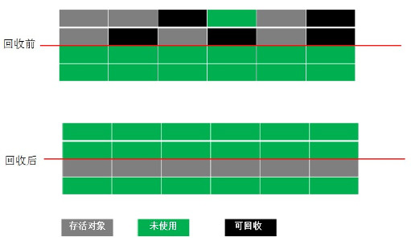
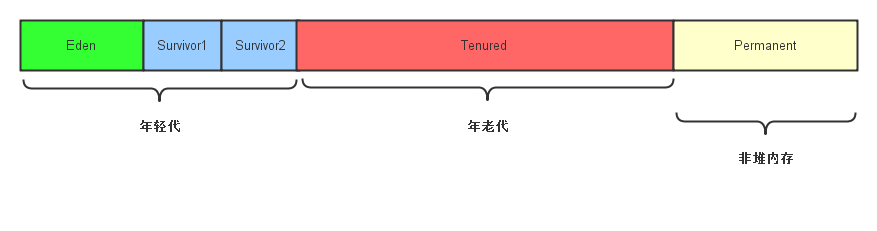

文章记录了java内存垃圾收集器回收的一些算法，及相关的垃圾收集器。
<!--more-->

程序计数器, 虚拟机栈, 本地方法栈随线程而生, 随线程而灭, 不需要过多考虑回收.

垃圾回收主要关注Java堆和方法区.

## 判断对象是否可用的算法
### 引用计数算法
给对象中添加一个引用计数器, 每当有一个地方引用它时, 计数器就加1; 当引用失效时, 计数器就减1; 任何时刻计数器为0的对象就是不可能再被使用.  
主流java虚拟机都没有选用计数算法管理内存, 因为它很难解决对象之间相互循环引用的问题.  
循环引用

~~~java
		Instance ojeA,ojeB;
		ojeA.instance = objB;
		ojeB.instance = objA;
~~~
上述代码中ojeA与ojeB都有引用指定对方，但它们再无其他任何引用, 实际上这两个对象已经不可能再被访问, 但是它们因为互相引用对方, 导致它们的引用计数都不为0, 于是引用计数算法无法通知GC收集器回收它们。

### 可达性分析算法
以一系列"GC Roots"对象作为起始点, 开始向下搜索, 搜索所走过的路径称为引用链.当GC Roots到一个对象没有引用链时, 证明此对象不可用.

可作为GC Roots的对象包括:

+ 虚拟机栈(栈帧中的本地变量表)中引用的对象
+ 方法区中类静态属性引用的对象
+ 方法区中常用引用的对象
+ Native方法引用的对象

#### stop the world
可达性分析必须在一个能确保一致性的快照中进行, 就是整个分析期间整个执行系统看起来就像被冻结在某个时间点上, 不可以出现分析过程中对象引用关系还在不断变化的情况. 这点导致GC进行时必须停顿所有的java执行线程.

## 垃圾收集算法
### 标记 - 清除算法

分为"标记"和"清除"两个阶段:首先标记出所有需要回收的对象, 在标记完成后统一回收所有被标记的对象.

不足:  
效率问题:标记和清除的效率都不高  
空间问题:标记清除的产生大量不连续的内存碎片.

### 复制算法
将可用内存划分为容量大小相等的两块, 每次只使用基本一块. 当这一块内存用完了, 将存活的对象复制到另外一块, 将这一块内存一次清除.

不足:  
可用内存缩小为原来的一半.

### 标记 - 整理算法
与标记 - 清除算法一样, 但后续步骤不是直接对可回收对象进行清理, 而是让所有存活的对象都向一端移动, 然后直接清理掉边界外的内存.

## 分代收集算法
### 内存分区
JVM根据对象存活周期不同将内存划分为几块. 一般将Java堆分为年轻区和年老代.

### 年轻区回收 Minor GC
年轻区每次收集都有大批对象死去, 所以选用复制算法。  
对象的内存分配都是先在Eden区域中进行的，当Eden区域的空间不足于分配新对象时，就会触发年轻区上的垃圾回收（发生在Eden和Survivor内存区域上），所有存活的对象（仍然可达对象）会被拷贝到其中一个Survivor区域。  
当第二次minor gc被触发时，JVM会会将Eden内存区域和Survivor1内存区域存活的对象拷贝到新的Survivor2内存区域，并清空Eden内存区域和Survivor1内存区域。

#### 进入年老区
虚拟机给每个对象定义了一个对象年龄计数器。如果对象在Eden出生并经过第一次Minor GC后仍存活并被移到Survivor空间，那对象年龄将被设为1。对象在Survivor区每经过一次Minor GC，年龄就加1。当它的年龄增加到一定程度（默认为15，可通过 -XX:maxtenuringthreshold配置）, 将被移动到年老区.

如果在Survivor空间中相同年龄的对象大小总和大于Survivor空间的一半, 年龄大于或等于该年龄的对象直接进行年老代, 无须等到maxtenuringthreshold要求的年龄.

对于大对象（需要大量连续内存空间的Java对象，最典型的大对象就是很长的字符串以及数组，如byte[]）
虚拟机提供 -XX:pretenuresizethreshold 参数, 令大于这个设置值的对象直接在年老代分配, 避免在Eden区及两个Survivor区之间发生大量内存复制。

#### 空间分配担保
Minor GC时，如果一个Survivor区域无法容纳所有的存活对象，则Survivor区域无法容纳所有的存活对象将直接进入年老区。  
发生Minor GC之前, 虚拟机会先检查年老代最大可用的连续空间是否大于年轻区所有对象总空间, 如果条件成立, Minor GC是安全的. 如果条件不成立, 虚拟机会查看HandlePromotionFailure设置值是否允许担保失败, 如果允许, 那么会继续检查年老代最大可用连续空间是否大于历次移动到年老代对象的平均大小, 如果大于, 将尝试进行一次Minor GC, 如果小于或不允许担保失败, 将进行Full GC。  
如果年轻区中大量对象存活, 一个Survivor和年老代都无法容纳这些对象, 那么将发生担保失败.如果担保失败, 只好在失败后重新发起一次Full GC.

### 年老代回收
年老代对象存活率高, 没有额外空间进行分配担保, 必须使用"标记 - 清除" 或 "标记 - 整理"

## 垃圾收集器
### 年轻区收集器

**Serial收集器**  
单线程  
Client模式下默认年轻区收集器  

**ParNew收集器**   
Serial收集器的多线程版  
许多虚拟机Server模式下首选的年轻区收集器

**Parallel Scavenge收集器**    
年轻区收集器, 使用复制算法 并发  
关注点不是尽可能缩短垃圾收集时用户线程的停顿时间，而是达到一个可控制的吞吐量（*吞吐量=运行用户代码时间/(运行用户代码时间+垃圾回收时间), 如虚假机运行100分钟, 其中垃圾收集花掉1分钟, 吞吐量就是99%*）  

停顿时间越短就越适合需要与用户交互的程序，而高吞吐量则可以高效地利用cpu时间，主要适用于后台运算而不需要过多交互的任务。

### 年老区收集器
**Serial old收集器**  
Serial收集器的年老代版本   
单线程, "标记 - 整理"算法  
主要提供给Client模式下的虚构机使用

**Parallel old收集器**  
Parallel Scavenge收集器的年老代版本  
多线程, "标记 - 整理"算法  
在注重吞吐量及CPU资源敏感的场合, 都可以优先使用Parallel Scavenge收集器加Parallel old收集器

**CMS收集器**  
CMS等收集则致力于尽可能缩短垃圾收集时用户线程依赖时间, 适合于需要与用户交互的程序, 非常符合互联网站或B/S系统的服务端.  
CMS收集器基于"标记 - 清除"算法，实现了让垃圾收集线程和用户线程(基本上)同时工作：  
1. 初始标记: stop the world 仅标记一下GC Roots能直接关联的对象, 速度很快  
2. 并发标记: GC Roots tracing   
3. 重新标记: stop the world 修正并发标记期间因用户程序继续运行而导致标记变动的那一部分对象的标记记录. 速度很快  
4. 并发清除: 清除垃圾

缺点  
1. 对CPU资源敏感：占用部分线程(CPU资源), 使用用户线程变慢, 总吞吐量降低.  
2. 产生大量内存碎片
3. 无法处理浮动垃圾：由于CMS并发清理时用户线程还在运行，还有会垃圾产生，CMS无法在当次收集中处理它们, 只能留待下一次GC时再清理。这部分垃圾称为"浮动垃圾"。 所以CMS需要预留部分空间提供给用户线程使用， 如果CMS运动期间预留的内存无法满足用户线程，就会出现一次"Concurrent Mode Failure"失败，这时虚拟机将启动后备预案：临时启用Serial old收集器重新进行年老代的垃圾收集，这样停顿时间更长了。

### G1收集器
G1收集器可以作用于年轻区和年老区。

G1收集器比较复杂，可参考[Java Hotspot G1 GC的一些关键技术](http://tech.meituan.com/g1.html)

