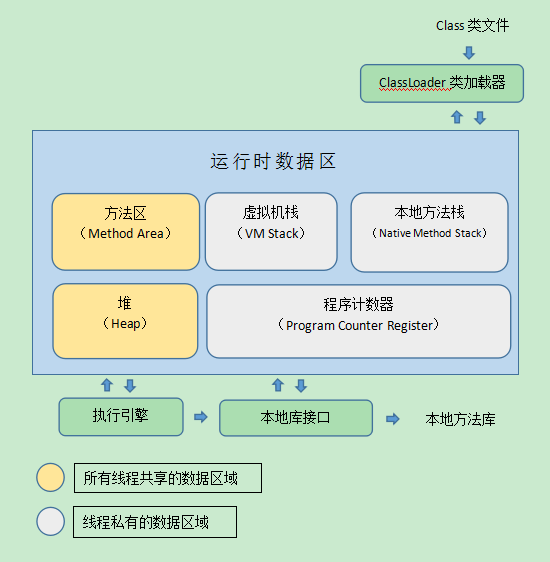
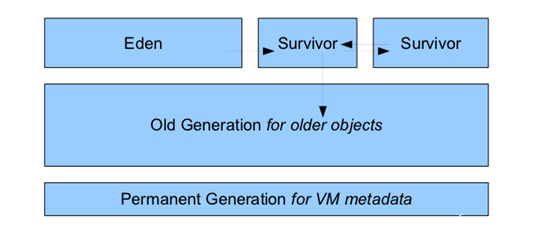
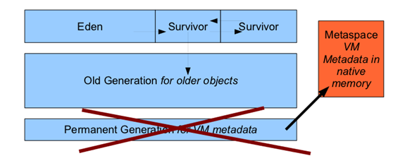

**运行时数据区域**
java虚拟机在执行java程序的过程中会把它管理的内存划分为若干不同的数据区域。这些区域都有各自的用途，以及创建和销毁时间。有的区域随着虚拟机启动而存在，有些区域则依赖用户线程的启动和结束而建立和销毁。  



# 程序计数器
每一条java虚拟机线程都有自己的pc寄存器。
如果当前方法不是Native方法，pc寄存器会保存虚拟机正在执行的字节码指令的地址;如果当前方法是Native方法，则pc寄存器的值为undefined。

此区域任何情况都不能导致OutOfMemoryError情况的区域  

# Java虚拟机栈

线程私有,生命周期与线程相同.

每个方法在执行的同时都会创建一个栈帧用于存储局部变量表, 操作数栈, 动态链接, 方法出口等信息.每一个方法从调用直至执行完成的过程, 都对应一个栈帧在虚拟机栈中入栈到出栈的过程.

如果线程请求的栈深度大于虚拟机所允许的深度, 将抛出StackOverflowError异常.

如果虚拟机栈可以动态扩展, 但如果扩展时无法申请到足够的内存,或者在创建新的线程时没有足够的内存去创建对应的虚拟机栈帧，则抛出OutOfMemoryError异常.

-Xss参数可以设定栈容量。

```
/**
 * VM Args : -Xss128k
 */
public class JavaVMStackSOF {
	private int stackLength = 1;
	
	public void stackLeak() {
		stackLength++;
		stackLeak();
	}
	
	public static void main(String[] args) {
		JavaVMStackSOF oom = new JavaVMStackSOF();
		try {
			oom.stackLeak();
		} catch (Throwable e) {
			System.out.println("stack length : " + oom.stackLength);
			e.printStackTrace();
		}
	}
}
```
`stackLeak()`方法不断调用自身，导致虚拟机栈溢出，抛出异常`java.lang.StackOverflowError`


# 本地方法栈

与虚拟机栈相似, 但它为虚拟机用到的Native方法服务.

同样抛出StackOverflowError异常和OutOfMemoryError异常.

本地方法无法设定（-Xoss无效）

	
# Java堆
用于存放对象实例，所有线程共享  
所有对象实例和数组都要在堆上分配.(栈上分配, 标量替换等优化技术除外)  
可以处于物理上不连续的内存空间, 只要逻辑上是连续的即可.

-Xms128m JVM初始分配的堆内存  
-Xmx512m JVM最大允许分配的堆内存，可按需扩展  

~~~java
/**
 * VM Args : -Xms10m -Xmx10m -XX:+HeapDumpOnOutOfMemoryError
 */
public class HeapOOM {
	public static void main(String[] args) {
		List<Object> list = new ArrayList<Object>();
		while(true) {
			list.add(new Object());
		}
	}
}
~~~
`list`不断存入创建的Object对象，导致Java堆内存不足，抛出`java.lang.OutOfMemoryError: Java heap space`异常。


# 方法区
方法区用于存储已被虚拟机加载的类信息，常量，静态变量，即时编译器编译后的代码等数据。
运行时常量池是方法区的一部分，用于存储编译期生成的各种字面量和符号引用。

线程共享

当方法区无法满足内存分配需求时, 将抛出OutOfMemoryError异常.


方法区常被称为“永久代”，实际上Full GC会进行持久代的回收。


# jdk8变化
jdk6:


jdk8:

从JDK7已经开始永久代的移除工作了，贮存在永久代的一部分数据已经转移到了Java Heap或者是Native Heap。但永久代仍然存在于JDK7，并没有完全的移除：符号引用(Symbols)转移到了native heap;字面量(interned strings)转移到了java heap;类的静态变量(class statics)转移到了java heap。  
Jdk8 中方法区被完全的移除了，直接使用本地内存来表示类的元数据，这个区域就叫做元空间。
JVM会忽略PermSize和MaxPermSize这两个参数，也不会出现java.lang.OutOfMemoryError: PermGen error的异常了。  


```
public class StringOomMock {
    private static String  base = "string";
    public static void main(String[] args) {
        List<String> list = new ArrayList<String>();
        for (int i=0;i< Integer.MAX_VALUE;i++){
            String str = base + base;
            base = str;
            list.add(str.intern());
        }
    }
}
```


在jdk8 下，抛出如下异常
```
Exception in thread "main" java.lang.OutOfMemoryError: Java heap space
	at java.util.Arrays.copyOf(Arrays.java:3332)
	at java.lang.AbstractStringBuilder.expandCapacity(AbstractStringBuilder.java:137)
	at java.lang.AbstractStringBuilder.ensureCapacityInternal(AbstractStringBuilder.java:121)
	at java.lang.AbstractStringBuilder.append(AbstractStringBuilder.java:421)
	at java.lang.StringBuilder.append(StringBuilder.java:136)
	at memory.StringOomMock.main(StringOomMock.java:14)
	at sun.reflect.NativeMethodAccessorImpl.invoke0(Native Method)
	at sun.reflect.NativeMethodAccessorImpl.invoke(NativeMethodAccessorImpl.java:62)
	at sun.reflect.DelegatingMethodAccessorImpl.invoke(DelegatingMethodAccessorImpl.java:43)
	at java.lang.reflect.Method.invoke(Method.java:498)
	at com.intellij.rt.execution.application.AppMain.main(AppMain.java:140)

Process finished with exit code 1
```
可以看到发生了堆内存溢出，可见字符串常量已经由永久代转移到堆中。


# 直接内存
直接内存不属于虚拟机运行时数据，也不是Java虚拟机规范中定义的内存区域。  
但可以通过NIO（DirectByteBuffer）操作直接内存，从而避免在Java堆和Native堆中复制数据。操作直接内存也可能导致DirectByteBuffer异常出现。  
直接内存的分配不受Java堆大小的限制，但会受到本机总内存大小及处理器寻址空间的限制。

参考：  
[深入理解Java虚拟机（第2版）](https://book.douban.com/subject/24722612/)  

[Java8内存模型—永久代(PermGen)和元空间(Metaspace)](http://www.cnblogs.com/paddix/p/5309550.html)

[Java永久代去哪儿了](http://droidyue.com/blog/2015/08/22/where-has-the-java-permgen-gone/index.html)

