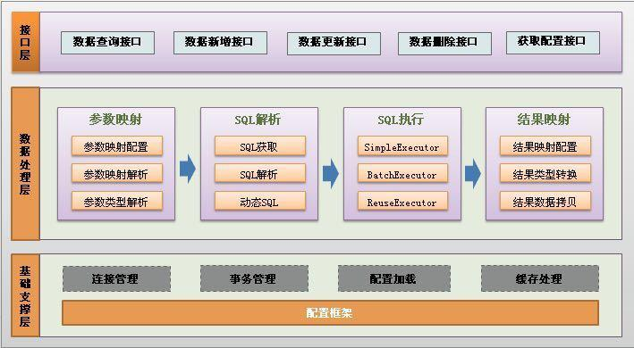

### 简单实例
应用官网上一个简单的实例

mybatis-config.xml
```
...
<configuration>
    <environments default="development">
        <environment id="development">
            ...
        </environment>
    </environments>
    <mappers>
        <mapper resource="mapper/BlogMapper.xml"/>
    </mappers>
</configuration>
```

BlogMapper.xml
```
...
<mapper namespace="mapper.blog.BlogMapper">
    <select id="selectBlog" resultType="domain.blog.Blog">
        select * from Blog where id = #{id}
    </select>
</mapper>
```
  

```
BlogMapper.java
public interface BlogMapper {
    Blog selectBlog(long id);i
}
  

测试方法
@Test
public void  test() throws IOException {
    String resource = "mybatis-config.xml";
    InputStream inputStream = Resources.getResourceAsStream(resource);
    SqlSessionFactory sqlSessionFactory  = new SqlSessionFactoryBuilder().build(inputStream);

    SqlSession session = sqlSessionFactory.openSession();
    try {
        Blog blog = session.selectOne("mapper.blog.BlogMapper.selectBlog", 1);

        Systet.out.println(blog);
    } finally {
        session.close();
    }
}
```

例子很简单。


**mybatis分层结构**如下


下面简单看一下mybatis中sql查询的执行流程。
### 构建过程
`new SqlSessionFactoryBuilder().build(inputStream)`会解析mybatis-config.xml配置文件，并构建SqlSessionFactory对象。
```
public SqlSessionFactory build(InputStream inputStream, String environment, Properties properties) {
    ...
    XMLConfigBuilder parser = new XMLConfigBuilder(inputStream, environment, properties);
    return build(parser.parse());
}
```

`parser.parse()`使用`XMLConfigBuilder`对mybatis-config.xml解析，会将解析结果将存放到XMLConfigBuilder父类BaseBuilder的`configuration`属性中，并返回`configuration`属性。

而`build(Configuration config)`则创建一个DefaultSqlSessionFactory对象
```
public SqlSessionFactory build(Configuration config) {
    return new DefaultSqlSessionFactory(config);
}
```

`XMLConfigBuilder`解析配置文件过程为
```
public Configuration parse() {
    ...
    parseConfiguration(parser.evalNode("/configuration"));
}


private void parseConfiguration(XNode root) {
    try {
      propertiesElement(root.evalNode("properties")); //issue #117 read properties first
      typeAliasesElement(root.evalNode("typeAliases"));
      pluginElement(root.evalNode("plugins"));
      objectFactoryElement(root.evalNode("objectFactory"));
      objectWrapperFactoryElement(root.evalNode("objectWrapperFactory"));
      settingsElement(root.evalNode("settings"));
      environmentsElement(root.evalNode("environments")); // read it after objectFactory and objectWrapperFactory issue #631
      databaseIdProviderElement(root.evalNode("databaseIdProvider"));
      typeHandlerElement(root.evalNode("typeHandlers"));
      mapperElement(root.evalNode("mappers"));
    } catch (Exception e) {
      throw new BuilderException("Error parsing SQL Mapper Configuration. Cause: " + e, e);
    }
}
```
可以看到方法中对mybatis-config.xml配置的内容逐一进行了解析，这里不再细说。


### 获取SqlSession
```
SqlSession session = sqlSessionFactory.openSession();
```
`DefaultSqlSessionFactory.openSession()`将构造一个DefaultSqlSession对象
```
public SqlSession openSession() {
    return openSessionFromDataSource(configuration.getDefaultExecutorType(), null, false);
}

private SqlSession openSessionFromDataSource(ExecutorType execType, TransactionIsolationLevel level, boolean autoCommit) {
    ...
    final Environment environment = configuration.getEnvironment();
    final TransactionFactory transactionFactory = getTransactionFactoryFromEnvironment(environment);
    tx = transactionFactory.newTransaction(environment.getDataSource(), level, autoCommit);
    final Executor executor = configuration.newExecutor(tx, execType);
    return new DefaultSqlSession(configuration, executor, autoCommit);
}
```
上述方法中创建了事务管理工厂，简单的执行器SimpleExecutor，并构造了DefaultSqlSession。


### 执行查询
```
Blog blog = session.selectOne("mapper.blog.BlogMapper.selectBlog", 1);
```
跟踪`session.selectOne`调用过程，最终调用到`DefaultSqlSession.selectList()`方法
```
public <E> List<E> selectList(String statement, Object parameter, RowBounds rowBounds) {
	...
	MappedStatement ms = configuration.getMappedStatement(statement);
	List<E> result = executor.query(ms, wrapCollection(parameter), rowBounds, Executor.NO_RESULT_HANDLER);
	return result;
}
```
MappedStatement是BlogMapper.xml的解析结果，解析过程在`XMLConfigBuilder.mapperElement(XNode parent)`方法。


`executor.query`将调用SimpleExecutor父类BaseExecutor的`query`方法
```
public <E> List<E> query(MappedStatement ms, Object parameter, RowBounds rowBounds, ResultHandler resultHandler) throws SQLException {
    BoundSql boundSql = ms.getBoundSql(parameter);  // 生成sql语句
    ...
    return query(ms, parameter, rowBounds, resultHandler, key, boundSql);   // 执行查询
}

public <E> List<E> query(MappedStatement ms, Object parameter, RowBounds rowBounds, ResultHandler resultHandler, CacheKey key, BoundSql boundSql) throws SQLException {
    ...
    // 从缓存中读取
    list = resultHandler == null ? (List<E>) localCache.getObject(key) : null;
    if (list != null) { // 存在缓存数据
        handleLocallyCachedOutputParameters(ms, key, parameter, boundSql);
    } else {    // 不存在缓存数据，从数据库中查询    
        list = queryFromDatabase(ms, parameter, rowBounds, resultHandler, key, boundSql);  
    }
}

private <E> List<E> queryFromDatabase(MappedStatement ms, Object parameter, RowBounds rowBounds, ResultHandler resultHandler, CacheKey key, BoundSql boundSql) throws SQLException {
    ... 
    list = doQuery(ms, parameter, rowBounds, resultHandler, boundSql);
}
```

`ms.getBoundSql(parameter)`是一个关键方法，负责生成sql语句。  

`doQuery`由`SimpleExecutor`实现
```
  public <E> List<E> doQuery(MappedStatement ms, Object parameter, RowBounds rowBounds, ResultHandler resultHandler, BoundSql boundSql) throws SQLException {
    Statement stmt = null;
    try {
      Configuration configuration = ms.getConfiguration();	
      StatementHandler handler = configuration.newStatementHandler(wrapper, ms, parameter, rowBounds, resultHandler, boundSql);	// 生成StatementHandler
      stmt = prepareStatement(handler, ms.getStatementLog());	// 参数处理
      return handler.<E>query(stmt, resultHandler);	// 查询及处理结果
    } finally {
      closeStatement(stmt);
    }
  }
```

StatementHandler是一个关键的Handler接口，有如下方法
```
public interface StatementHandler {
  Statement prepare(Connection connection) throws SQLException;

  void parameterize(Statement statement) throws SQLException;

  void batch(Statement statement) throws SQLException;

  int update(Statement statement) throws SQLException;

  <E> List<E> query(Statement statement, ResultHandler resultHandler) throws SQLException;

  BoundSql getBoundSql();

  ParameterHandler getParameterHandler();
}
```
这些方法负责对真实数据库进行处理。StatementHandler有如下实现类


`configuration.newStatementHandler`将生成一个RoutingStatementHandler类，RoutingStatementHandler实际上是对PreparedStatementHandler，CallableStatementHandler，SimpleStatementHandler的路由处理，会根据MappedStatement.StatementType，将请求对应转发到这些类上。  
```
public StatementHandler newStatementHandler(Executor executor, MappedStatement mappedStatement, Object parameterObject, RowBounds rowBounds, ResultHandler resultHandler, BoundSql boundSql) {
    StatementHandler statementHandler = new RoutingStatementHandler(executor, mappedStatement, parameterObject, rowBounds, resultHandler, boundSql);
    statementHandler = (StatementHandler) interceptorChain.pluginAll(statementHandler); // 添加拦截器
    return statementHandler;
}
```
MappedStatement.StatementType默认为PREPARED，即使用PreparedStatementHandler。


`prepareStatement(handler, ms.getStatementLog())`会创建Statement对象，并处理sql查询参数
```
private Statement prepareStatement(StatementHandler handler, Log statementLog) throws SQLException {
    Statement stmt;
    Connection connection = getConnection(statementLog);    // 创建Statement对象
    stmt = handler.prepare(connection); // 处理sql查询参数
    handler.parameterize(stmt);
    return stmt;
}
```
  
`handler.parameterize`会调用PreparedStatementHandler.parameterize方法：
```
public void parameterize(Statement statement) throws SQLException {
    parameterHandler.setParameters((PreparedStatement) statement);
}
```
parameterHandler负责对参数进行处理。

`handler.<E>query`则调用PreparedStatementHandler.query方法:
```
public <E> List<E> query(Statement statement, ResultHandler resultHandler) throws SQLException {
    PreparedStatement ps = (PreparedStatement) statement;
    ps.execute();   // 执行sql语句
    return resultSetHandler.<E> handleResultSets(ps);   // 处理结果
}
```
resultSetHandler负责对结果进行处理。

上述只是简单记录了mybatis的sql查询的执行流程，并没有对核心的实现进行详细分析，如
**MappedStatement.getBoundSql**解析sql语句  
**ParameterHandler.setParameters**处理查询参数  
**resultSetHandler.handleResultSets**处理查询结果  
**连接管理**  
**事务管理**  
**缓存实现**

