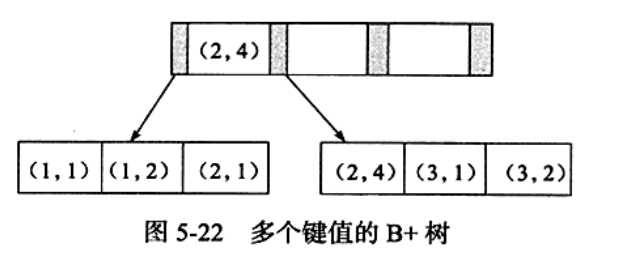

MYSQL目前提供了一下4种索引。
+ B-Tree 索引：最常见的索引类型，大部分引擎都支持B树索引。
+ HASH 索引：只有Memory引擎支持，使用场景简单。
+ R-Tree 索引(空间索引)：空间索引是MyISAM的一种特殊索引类型，主要用于地理空间数据类型。
+ Full-text (全文索引)：全文索引也是MyISAM的一种特殊索引类型，主要用于全文索引，InnoDB从MYSQL5.6版本提供对全文索引的支持。

下面简单记录一下innodb中的索引，主要来自[MySQL技术内幕](https://book.douban.com/subject/24708143/)。
## 聚集索引（clustered index）
InnoDb存储引擎表是索引组织表，即表中数据按照主键顺序存放。
聚集索引就是按照每张表的主键构造一个B+树，同时叶子节点中存放行记录数据（叶子节点也称数据页）。聚集索引这个特性决定索引组织表中数据也是索引的一部分。

非数据页存放键值和指向数据页的偏移量。

每个数据页通过一个双向链表进行链接。
每个表只能拥有一个聚集索引。

## 辅助索引
**非聚集索引（Secondary Index）**
叶子节点并不包含行记录的全部数据。叶子节点除了包含键值以外，还包含一个书签（bookmark）。该书签用来告诉InnoDb存储引擎哪里可以找到与索引相对应的行数据。实际上就是相应行数据的聚集索引键。

当通过辅助索引索引来寻找数据时，InnoDD存储引擎会遍历索引并通过叶级别的指针获得指向主键索引的主键，然后再通过主键来找到一个完整的行记录。比如在一个高度为3的辅助索引树中查找数据，需要对这棵辅助索引树遍历3次找到指定主键，如果聚集索引树高度同样为3，还需要对聚集索引树进行3次查找，最终找到一个完整的行数据所在页。

**唯一索引**
表示唯一的，不允许重复的索引，如果该字段信息保证不会重复例如身份证号用作索引时，可设置为unique

**联合索引**
对表上多个列进行索引。
联合索引也是一棵B+树，但联合索引的键值所索引列的值。

```
create table t (
	a int,
	b int,
	primary key (a),
	key idx_a_b (a, b)
)

```


键值都是排序的。即(1, 1),(1, 2),(2, 1), (2, 4), (3, 1), (3, 2)。索引按(a, b) 的顺序进行存放。

select * from table where a=XXX and b =XXX 可以使用联合索引，
select * from table where a=XXX也可以。
select * from table where  b =XXX 不能使用联合索引。因为叶子节点的b值为1,2,1,4,1,2，是不排序。

**聚集索引和辅助索引都是B-Tree 索引**

## 自适应哈希索引
InnoDb存储引擎会监控对表上各索引页的查询。如果观察到建立哈希索引可以提升速度，则建立哈希索引。
自适应哈希索引是InnoDB存储引擎自己控制的。无法干预。


## 全文索引
全文索引通过将文档进行分词，并在辅助表中存储单词与单词自身所在一个或多个文档所在位置之间的映射来进行索引。

非dba， 写得比较简单


一些优秀的博文：
[MYSQL-索引](https://segmentfault.com/a/1190000003072424#articleHeader3)
[MySQL索引背后的数据结构及算法原理](http://blog.codinglabs.org/articles/theory-of-mysql-index.html)
[MySQL索引原理及慢查询优化](http://tech.meituan.com/mysql-index.html) - 推荐